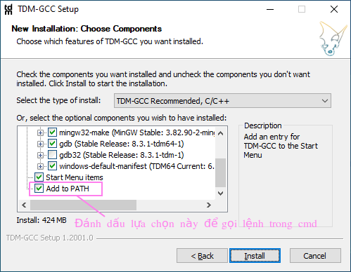
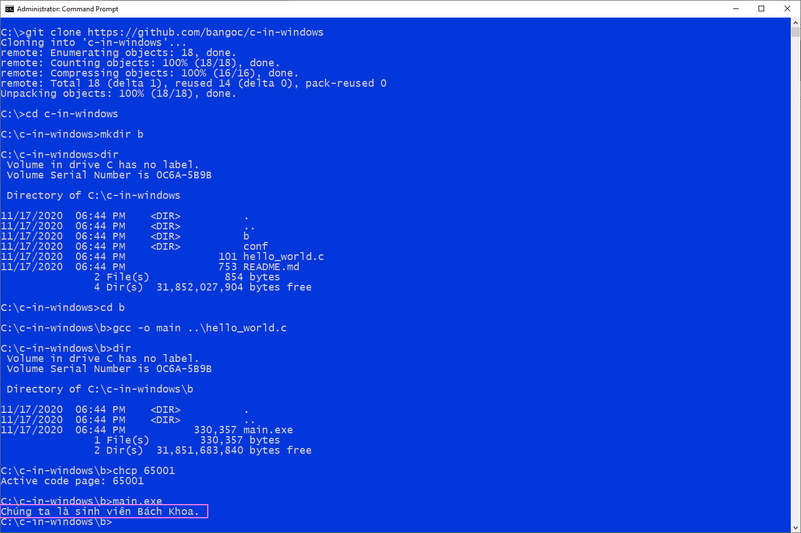

# Giới thiệu
Các hướng dẫn này được viết cho người lập trình C sử dụng Windows:

1. Phương án 1: Thiết lập môi trường lập trình và biên dịch mã nguồn C để tạo các ứng dụng bản địa (Native Applications).
2. Phương án 2: Nếu bạn cần một giải pháp thuận tiện để viết và chạy những mã nguồn C đơn giản thì có thể tham khảo các giải pháp trực tuyến như [Repl.it](https://repl.it/)

Có thể kết hợp cả 2 phương án cho mục đích học tập.

# Lập trình C trong Windows
Môi trường dòng lệnh & hiển thị tiếng việt bằng UTF-8

## Danh mục công cụ

1. Trình biên dịch: Nên sử dụng [TDM-GCC](https://jmeubank.github.io/tdm-gcc/).

Để có thể gọi lệnh biên dịch trong cmd (môi trường dòng lệnh của Windows) thì cần bổ xung đường dẫn đến thư mục chứa trình biên dịch vào biến môi trường PATH.

2. Trình soạn thảo mã nguồn:
Trong số những trình soạn thảo mã nguồn hiểu ngôn ngữ C, nên sử dụng trình soạn thảo mã nguồn khả chỉnh - có thể bổ xung các tính năng hỗ trợ bằng cách cài thêm plugin.
Ví dụ: [Sublime Text](https://www.sublimetext.com/), [Visual Studio Code](https://code.visualstudio.com/), [Atom](https://atom.io/).

## Biên dịch chương trình C nhỏ

Trình biên dịch mã nguồn C trong gói TDM-GCC là chương trình gcc.exe, chúng ta gọi ngắn gọn là gcc.

Để biên dịch chương trình C đơn giản trong môi trường dòng lệnh bằng gcc chúng ta có thể sử dụng câu lệnh đơn giản nhất như sau:

`gcc -o <tệp đầu ra> <tệp đầu vào>`

ví dụ:

`gcc -o main hello_world.c`

Nếu tiến trình biên dịch thành công, thì chúng ta sẽ nhìn thấy chương trình với tên như trong câu lệnh biên dịch. Trong ví dụ là main.exe.

## Hiển thị thông điệp Unicode mã hóa UTF-8
Sau một chặng đường phát triển dài gần 30 năm cho tới thời điểm hiện tại thì ứng dụng cmd trong môi trường Windows 10 đã bắt đầu có khả năng hiển thị văn bản Unicode được mã hóa theo UTF-8, đánh dấu sự bắt đầu của một giải pháp ổn định để hiển thị các thông điệp văn bản đa ngôn ngữ.

Có thể thiết lập chế độ hiển thị UTF-8 bằng lệnh:

`chcp 65001`

Chạy chương trình main.exe thu được sau khi biên dịch bạn sẽ nhìn thấy thông báo tiếng việt trong cửa sổ dòng lệnh của Windows.

